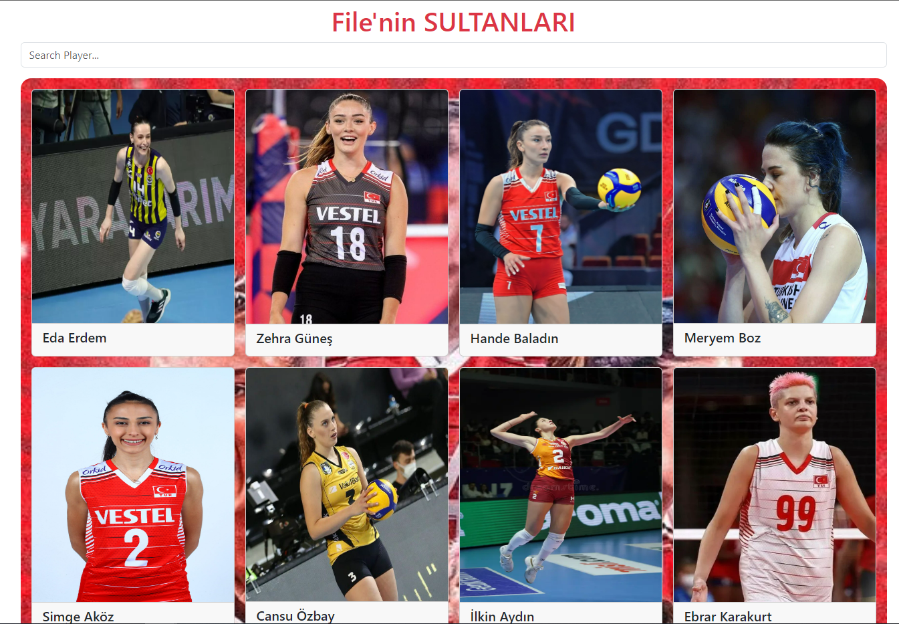

## React Bootstrap/filenin_sultanlri

### <a href="https://sparkling-trifle-685296.netlify.app/">Live</a>
## Gif

## image

## Project Skeleton

filenin sultanları (folder)
|
|----readme.md         
├── public
│     └── index.html
├── src
│    ├── components
│    │       ├── Header.jsx
│    │       ├── CardContainer.jsx
│    │       └── PlayerCard.jsx
│    ├── helper
│    │       └── data.js
│    ├── assets.js
│    │       └── [images]
│    ├── App.js
│    ├── index.js
│    └── index.css
├── package.json
└── yarn.lock

